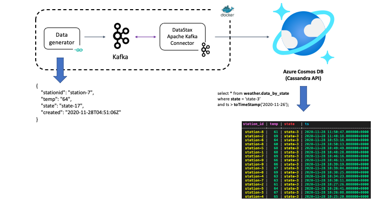

# Integrating Apache Kafka and Azure Cosmos DB Cassandra API using Kafka Connect

This blog post demonstrates how you can use an open source solution to ingest data from Kafka into Azure Cosmos DB Cassandra API. It uses a simple yet practical scenario along with a re-usable setup using Docker Compose to help with iterative development and testing. Use the open source [DataStax Apache Kafka connector](https://docs.datastax.com/en/kafka/doc/kafka/kafkaIntro.html) which is a Sink connector that works on top of Kafka Connect framework to ingest records from a Kafka topic into rows of one or more Cassandra table(s).

**High level diagram**

Sample weather data continuously generated into a Kafka topic. This is picked up by the connector and sent to Azure Cosmos DB and can be queried using any Cassandra client driver.

Except [Azure Cosmos DB](https://docs.microsoft.com/azure/cosmos-db/cassandra-introduction?WT.mc_id=data-11341-abhishgu), the rest of the components of the solution run as [Docker](https://docs.docker.com/get-started/overview/) containers (using [Docker Compose](https://docs.docker.com/compose/reference/overview/)). This includes Kafka (and Zookeeper), Kafka Connect worker (the Cassandra connector) along with the sample data generator ([Go](https://golang.org/)) application. You can easily customize this as per your own unique requirements, rinse and repeat!

*Link to blog post coming soon!*